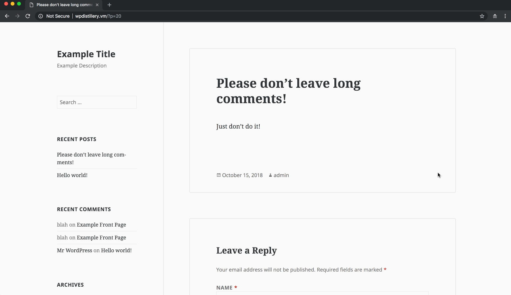

# Project 7 - WordPress Pentesting

Time spent: **5** hours spent in total

> Objective: Find, analyze, recreate, and document **five vulnerabilities** affecting an old version of WordPress

## Pentesting Report

1. (Required) CVE-2015-3440 - Unauthenticated Stored Cross-Site Scripting
  - [x] Summary:
    - Vulnerability types: XSS
    - Tested in version: 4.2
    - Fixed in version: 4.2.1
  - [x] GIF Walkthrough:
      
  - [x] Steps to recreate:
    1. Use an account that is allowed to post comments to the affected site.
    2. Post a comment that contains XSS injection content followed by at least 64 kilobytes of text.
    3. WordPress will truncate the comment, leading to malformed HTML, including injected content, being generated on the site.
  - [x] Affected source code:
    - [https://core.trac.wordpress.org/changeset/32299](https://core.trac.wordpress.org/changeset/32299)
  
2. (Required) CVE-2017-6814 - Authenticated XSS via Media File Metadata
  - [x] Summary:
    - Vulnerability types: XSS
    - Tested in version: 4.2
    - Fixed in version: 4.2.13
  - [x] GIF Walkthrough:
    
  - [x] Steps to recreate:
    1. Create an MP3 file with payload as an ID3 attribute (e.g., Track Title)
    2. Using an editor or administrator account, upload the MP3 file to affected site's media library.
    3. Insert an audio playlist containing the file into a post.
    4. The payload will execute when the post renders.
  - [x] Affected source code:
    - [https://github.com/WordPress/WordPress/commit/28f838ca3ee205b6f39cd2bf23eb4e5f52796bd7](https://github.com/WordPress/WordPress/commit/28f838ca3ee205b6f39cd2bf23eb4e5f52796bd7)
3. (Required) CVE-2018-12895 - Authenticated Arbitrary File Deletion
  - [x] Summary:
    - Vulnerability types: Path Traversal / Other
    - Tested in version: 4.2
    - Fixed in version: 4.2.21
  - [x] GIF Walkthrough:
    
  - [x] Steps to recreate:
    1. As an authorized user, upload an image to the affected site's media library.
    2. Click the "edit" link and note the image's ID as well as the _wpnonce value in the edit page form.
    3. Submit a request to the post.php page with the POST parameters: action=editattachment, _wpnonce=value obtained earlier, thumb= the path to a file on the server (e.g., ../../../../wp-config.php for the wp-config file)
    4. Locate _wpnonce for deleting the media, and submit a request to post.php with the POST parameters: action=delete, _wpnonce=value obtained from page
    5. The file specified in the thumb parameter will be deleted.
  - [x] Affected source code:
    - [https://github.com/WordPress/WordPress/commit/c9dce0606b0d7e6f494d4abe7b193ac046a322cd](https://github.com/WordPress/WordPress/commit/c9dce0606b0d7e6f494d4abe7b193ac046a322cd)

## Assets

Assets used for each vulnerability can be found in their folders:
[CVE-2015-3440](./vulnerabilities/CVE-2015-3440/)

[CVE-2017-6814](./vulnerabilities/CVE-2017-6814/)

[CVE-2018-12895](./vulnerabilities/CVE-2018-12895/)

## Resources

- [WordPress Source Browser](https://core.trac.wordpress.org/browser/)
- [WordPress Developer Reference](https://developer.wordpress.org/reference/)

GIFs created with [LiceCap](http://www.cockos.com/licecap/).

## Notes

Describe any challenges encountered while doing the work

## License

    Copyright 2018 Zachary Henkel

    Licensed under the Apache License, Version 2.0 (the "License");
    you may not use this file except in compliance with the License.
    You may obtain a copy of the License at

        http://www.apache.org/licenses/LICENSE-2.0

    Unless required by applicable law or agreed to in writing, software
    distributed under the License is distributed on an "AS IS" BASIS,
    WITHOUT WARRANTIES OR CONDITIONS OF ANY KIND, either express or implied.
    See the License for the specific language governing permissions and
    limitations under the License.
